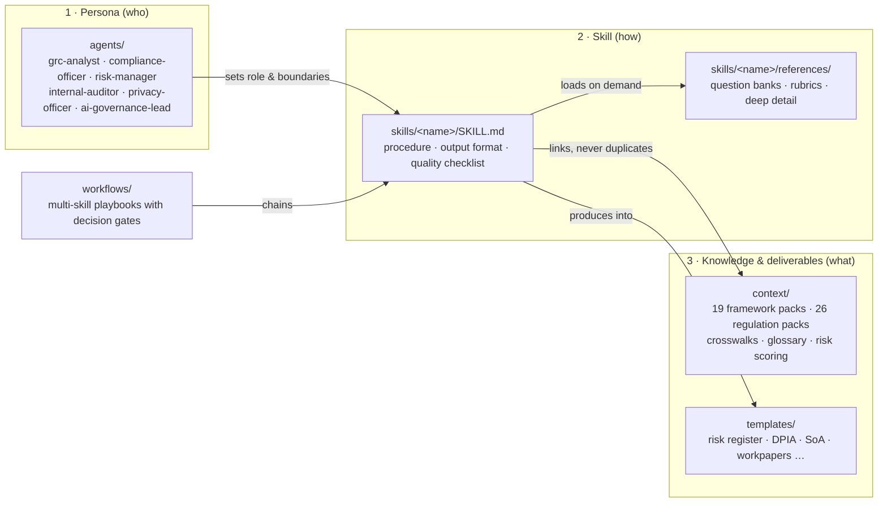

# Cyber GRC Agent Skills

[](https://github.com/smerphy/Cyber-GRC-Agent-Skills/actions/workflows/validate.yml)
[](LICENSE)
[](CONTRIBUTING.md)

Portable, provider-neutral AI agent skills for cyber Governance, Risk & Compliance. Load them into Claude, ChatGPT, or any capable LLM and get an agent that runs gap assessments, maps controls across frameworks, determines breach notification obligations, drafts policies, prepares audits, and more — following practitioner-grade procedures instead of improvising.

Everything is plain markdown in the open [Agent Skills format](https://agentskills.io) (`SKILL.md` + progressive-disclosure references). No provider lock-in, no runtime dependencies, no API keys.

## What's inside

```
agents/       6 persona system prompts (GRC analyst, compliance officer, risk manager,
              internal auditor, privacy officer, AI governance lead)
skills/       21 task skills, each a SKILL.md procedure + references/ deep material
context/      Shared knowledge packs: 19 frameworks, 26 regulation files, crosswalks,
              glossary, risk-scoring methods
workflows/    8 multi-step playbooks chaining skills with decision gates
templates/    11 deliverable skeletons (risk register, DPIA, SoA, workpapers, ...)
docs/         Integration guides (Claude, OpenAI, MCP, generic) and architecture notes
data/         Machine-readable breach-notification clocks (JSON) powering the tooling
evals/        Scenario + rubric regression tests for the advice itself
scripts/      Validator, installer, bundle builder, deadline calculator,
              MCP server, eval runner (all stdlib-only Python/bash)
```

### Skills

| Skill | What it does |
|---|---|
| [framework-gap-assessment](skills/framework-gap-assessment/SKILL.md) | Assess current state against NIST CSF 2.0, ISO 27001, CIS v8, SOC 2, 800-53, or PCI DSS; score maturity; produce a gap report and roadmap |
| [control-mapping](skills/control-mapping/SKILL.md) | Map controls across frameworks and from internal control sets, with partial-coverage ratings |
| [policy-authoring](skills/policy-authoring/SKILL.md) | Draft policies/standards/procedures with testable statements traced to framework controls |
| [policy-review](skills/policy-review/SKILL.md) | Review existing policies for testability, coverage, conflicts, and currency |
| [risk-assessment](skills/risk-assessment/SKILL.md) | Run a cyber risk assessment and write well-formed risk register entries |
| [exception-management](skills/exception-management/SKILL.md) | Process policy/control exceptions with risk-based approval, compensating controls, and expiry |
| [third-party-risk-assessment](skills/third-party-risk-assessment/SKILL.md) | Tier vendors, analyze questionnaires and SOC 2 reports, set contract requirements and monitoring |
| [grc-metrics-reporting](skills/grc-metrics-reporting/SKILL.md) | Design decision-driving KPIs/KRIs and board-level risk reporting |
| [audit-preparation](skills/audit-preparation/SKILL.md) | Build PBC lists, review evidence quality, and prep control owners for audit |
| [control-testing](skills/control-testing/SKILL.md) | Test control design and operating effectiveness with proper sampling and workpapers |
| [incident-regulatory-reporting](skills/incident-regulatory-reporting/SKILL.md) | Determine notification obligations after an incident, compute deadlines per regime, draft notifications |
| [regulatory-applicability](skills/regulatory-applicability/SKILL.md) | Determine which regulations and frameworks apply to an organization, with rationale |
| [dpia-privacy-assessment](skills/dpia-privacy-assessment/SKILL.md) | Screen for and conduct GDPR Art. 35 DPIAs focused on risks to individuals |
| [ai-governance](skills/ai-governance/SKILL.md) | Inventory and classify AI systems (EU AI Act), assess against NIST AI RMF, define AI controls |
| [soc2-readiness](skills/soc2-readiness/SKILL.md) | Prepare for SOC 2 Type I/II: criteria selection, system description, CC mapping, evidence dry run |
| [iso27001-readiness](skills/iso27001-readiness/SKILL.md) | Prepare for ISO 27001:2022 certification: ISMS scope, clauses 4–10, Statement of Applicability |
| [regulatory-horizon-scanning](skills/regulatory-horizon-scanning/SKILL.md) | Track upcoming regulatory change from authoritative sources and triage impact |
| [security-questionnaire-response](skills/security-questionnaire-response/SKILL.md) | Answer inbound customer security questionnaires (SIG, CAIQ, custom) truthfully from a canonical answer library |
| [dsar-handling](skills/dsar-handling/SKILL.md) | Handle data subject rights requests end to end across GDPR, CCPA/CPRA, and other regimes, with deadlines and exemptions |
| [ropa-data-mapping](skills/ropa-data-mapping/SKILL.md) | Build and maintain GDPR Art. 30 Records of Processing and the underlying data map, reusable across regimes |
| [bcdr-readiness](skills/bcdr-readiness/SKILL.md) | Assess and build business continuity / disaster recovery readiness: BIA, declared-vs-demonstrated recovery gaps, exercise programs |

### Coverage

**Frameworks:** NIST CSF 2.0 · ISO/IEC 27001:2022 · CIS Controls v8/v8.1 · SOC 2 (TSC) · NIST SP 800-53 r5 · NIST SP 800-171 + CMMC 2.0 · FedRAMP · PCI DSS v4 · HITRUST CSF · CSA CCM v4 · COBIT 2019 · NERC CIP · NIST AI RMF · ISO/IEC 42001 · ISO/IEC 27701 · ISO 22301 · ACSC Essential Eight · UK Cyber Essentials · TISAX

**Regulations & laws:** EU GDPR · NIS2 · DORA · EU AI Act · EU Cyber Resilience Act · CER Directive · ePrivacy · UK (UK GDPR, PECR, NIS, resilience) · HIPAA · CCPA/CPRA and US state privacy & breach laws · SOX (ITGC) · SEC cyber disclosure · GLBA / FTC Safeguards · NYDFS Part 500 · CIRCIA · FISMA · US sectoral privacy (COPPA, FERPA, HBNR) · Australia (Privacy Act/NDB, SOCI, CPS 234) · Canada (PIPEDA, Quebec Law 25) · Singapore · Japan · South Korea · India (DPDP, CERT-In) · China (PIPL/DSL/CSL) · Brazil (LGPD) · plus Switzerland, Saudi Arabia, UAE, South Africa, New Zealand, Israel summaries

**Crosswalks:** domain-level control crosswalk across the six frameworks; breach-notification deadline matrix across all covered regimes.

## Quick start

### Claude Code

**As a plugin** (recommended — one command, includes the personas as agents):

```
/plugin marketplace add smerphy/Cyber-GRC-Agent-Skills
/plugin install cyber-grc@cyber-grc-skills
```

**Or with the install script** (copy or symlink individual skills):

```bash
git clone https://github.com/smerphy/Cyber-GRC-Agent-Skills.git
cd Cyber-GRC-Agent-Skills
scripts/install.sh --list                                  # see what's available
scripts/install.sh --user risk-assessment soc2-readiness   # a curated few, user scope
scripts/install.sh --project --link                        # everything, symlinked, project scope
```

Skills auto-trigger from their `description` frontmatter ("assess our gaps against ISO 27001" loads `framework-gap-assessment`). Details: [docs/integrations/claude.md](docs/integrations/claude.md).

### claude.ai (Projects)

Create a Project, set a persona from `agents/` as project instructions, upload the `SKILL.md` and `references/` files for the skills you need plus the `context/` files they link to.

### ChatGPT (Custom GPT) / OpenAI API

Pre-built bundles do the curation for you — one zip per persona, with a 20-file variant sized for Custom GPT knowledge limits:

```bash
python3 scripts/build_bundles.py          # emits dist/<persona>.zip and dist/<persona>-gpt20.zip
```

Paste the bundle's `agents__<persona>.md` into GPT Instructions and upload the rest as knowledge (each bundle ships a MANIFEST.md). API: put persona + `SKILL.md` in the system/developer message, or index the repo into a vector store for file search. Details: [docs/integrations/openai.md](docs/integrations/openai.md).

### Any other provider

The three-layer assembly works in a plain prompt:

```
[system]  contents of agents/grc-analyst.md
[system]  contents of skills/incident-regulatory-reporting/SKILL.md
[user]    reference: contents of context/crosswalks/breach-notification-timelines.md
[user]    We detected unauthorized access to our EU customer database at 02:00 UTC today. <details...>
```

Details and RAG/chunking guidance: [docs/integrations/generic.md](docs/integrations/generic.md).

## Worked examples

See the skills producing real deliverables before installing anything: an [incident notification decision table](examples/incident-notification-decision.md) (multi-regime deadlines computed from timestamps), a [NIST CSF 2.0 gap assessment excerpt](examples/gap-assessment-excerpt.md), and a [vendor SOC 2 report review](examples/vendor-soc2-review.md). Index: [examples/](examples/README.md).

## Design



- **Three layers.** Personas define *who the agent is*, skills define *how a task is done*, context/templates define *what it needs to know and produce*. Compose them per task instead of one monolithic prompt.
- **Progressive disclosure.** Each `SKILL.md` stays small enough to load whole; depth (question banks, rubrics, per-regime detail) lives in `references/` and `context/` files loaded on demand. This keeps token cost proportional to the task.
- **Provider-neutral content.** No tool syntax, no vendor-specific markup anywhere in `skills/`, `context/`, `workflows/`, `agents/`, or `templates/`. Provider specifics are quarantined in `docs/integrations/`.
- **Anti-fabrication by construction.** Skills instruct the agent to tie conclusions to evidence, flag uncertainty, and never invent citations or compliance status. Every framework and regulation pack ends with a **Primary sources** section linking the official text (links verified at review time), plus a `Last reviewed` date and verification footer.
- **Validated.** `python3 scripts/validate_skills.py` checks skill frontmatter and sections, every cross-file link, verification footers and review dates, primary-source presence, workflow/persona headers, and CSV integrity; it runs in CI on every PR. `--stale N` reports packs due for re-review.

Full rationale: [docs/architecture.md](docs/architecture.md).

## Workflows

For multi-phase engagements, `workflows/` chains skills with explicit decision gates: [new-regulation impact assessment](workflows/new-regulation-impact-assessment.md), [annual risk assessment](workflows/annual-risk-assessment.md), [vendor onboarding](workflows/vendor-onboarding.md), [audit readiness](workflows/audit-readiness.md), [incident regulatory response](workflows/incident-regulatory-response.md), [policy lifecycle](workflows/policy-lifecycle.md), [certification readiness](workflows/certification-readiness.md), and [AI system intake](workflows/ai-system-intake.md).

## Advanced tooling

- **MCP server** — expose the whole library (skills, context, search, deadline computation) as native tools to Claude Desktop/Code, Cursor, or any MCP client: `scripts/mcp_server.py`, see [docs/integrations/mcp.md](docs/integrations/mcp.md).
- **Deadline calculator** — `python3 scripts/deadline_calc.py --regime gdpr --regime sec-8k --when awareness=2026-07-14T06:40Z --when materiality_determination=2026-07-16T17:00Z` computes a sorted deadline table honoring each regime's clock-start semantics, from the machine-readable [data/breach-timelines.json](data/breach-timelines.json) (kept in sync with the markdown matrix by the validator).
- **Eval harness** — [evals/](evals/README.md) holds scenarios with machine-gradable rubrics (required findings + forbidden wrong claims); `scripts/run_evals.py` grades any provider's answers and fails CI-style on regressions.
- **Freshness automation** — a monthly workflow opens a review issue when any pack's `Last reviewed` date passes 11 months; policy in [MAINTENANCE.md](MAINTENANCE.md).

**Roadmap:** OSCAL export of the control crosswalk for GRC-platform interop; structured data companions for the framework crosswalk; additional eval scenarios. Proposals welcome via the issue templates.

## Contributing

See [CONTRIBUTING.md](CONTRIBUTING.md). Short version: follow the skill format, run the validator, never fabricate citations, update `Last reviewed` dates when touching regulatory content, and cite the official source in your PR. Do not contribute verbatim text from licensed standards (ISO, PCI DSS) — summaries and structure only.

## Important limitations

- **Not legal advice.** This library supports analysis; it does not replace qualified counsel. Notification decisions, regulator interaction, and legal interpretation need lawyer review.
- **Regulations change.** Content reflects public sources as of the `Last reviewed` date in each file (initial release: 2026-07). Verify deadlines, thresholds, and penalties against official texts before relying on them.
- **LLMs make mistakes.** These skills reduce, but cannot eliminate, model error. Keep a human accountable for every compliance decision.

## License

[MIT](LICENSE). Framework and regulation names belong to their respective owners; this repository contains original summaries and procedures, not reproductions of licensed standard text.
